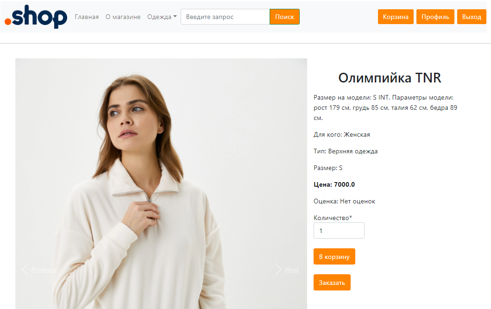
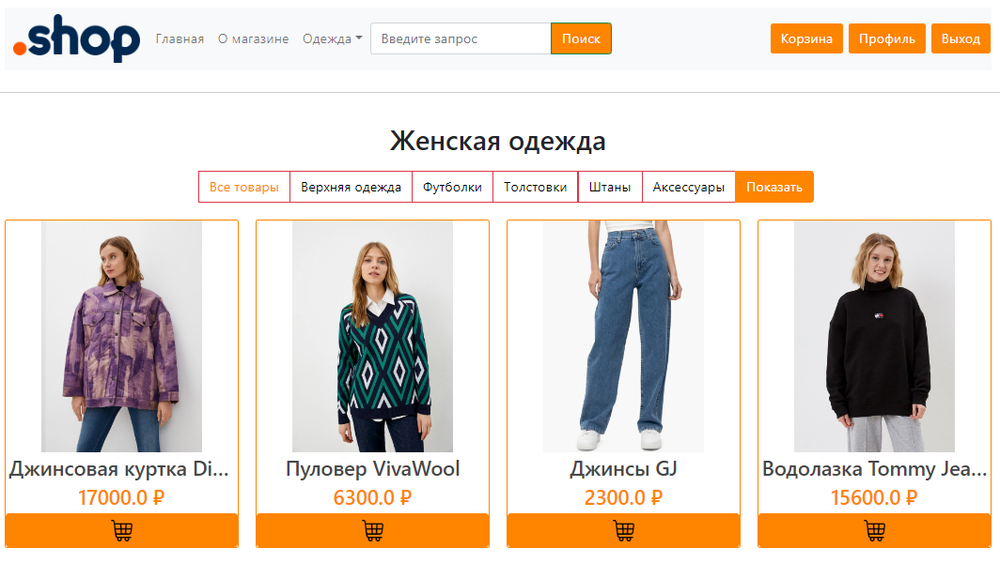
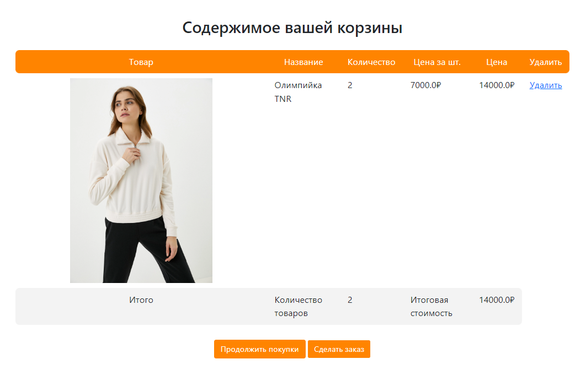
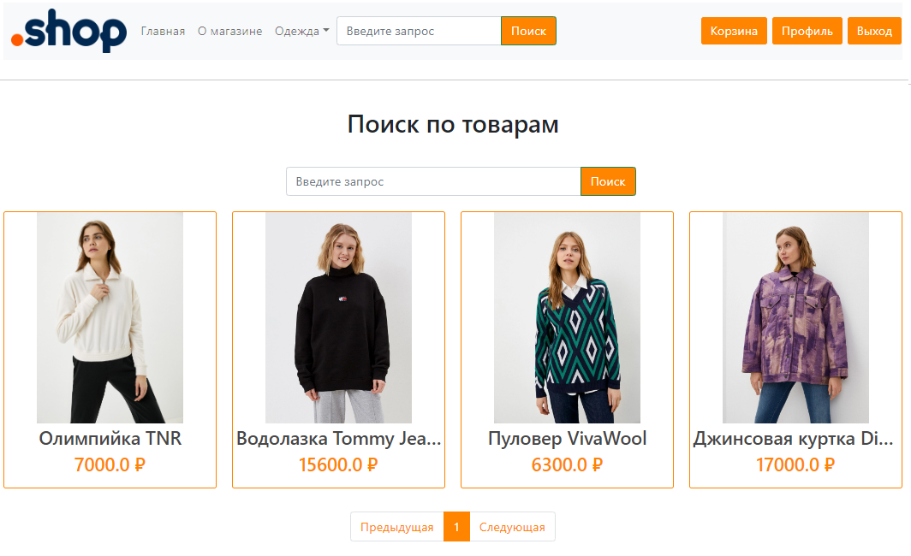
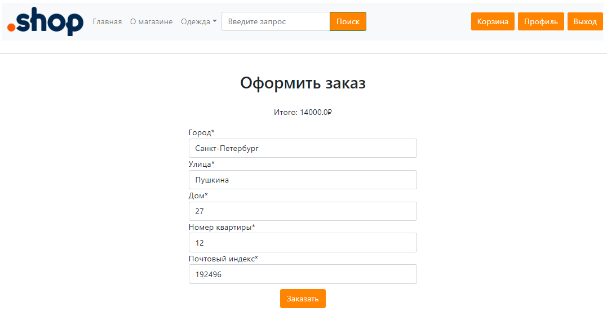
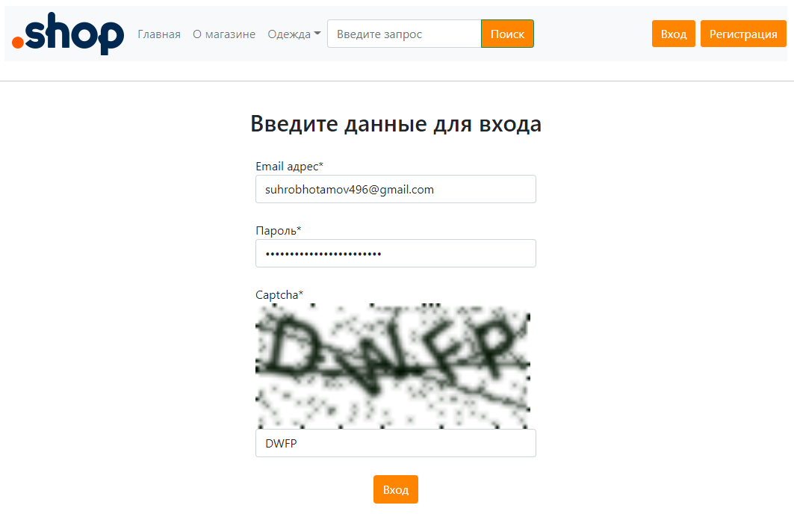
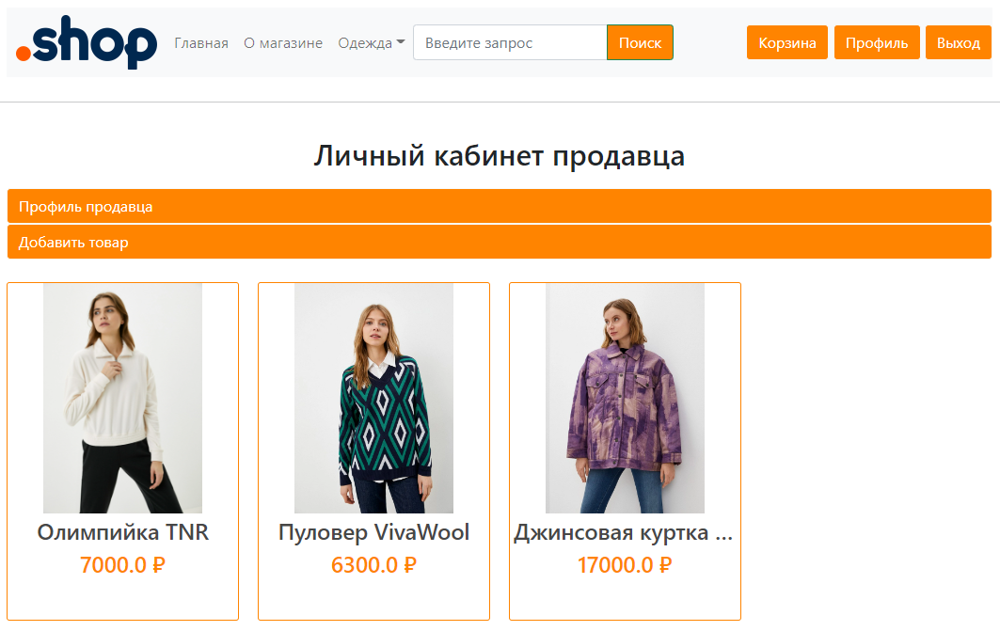
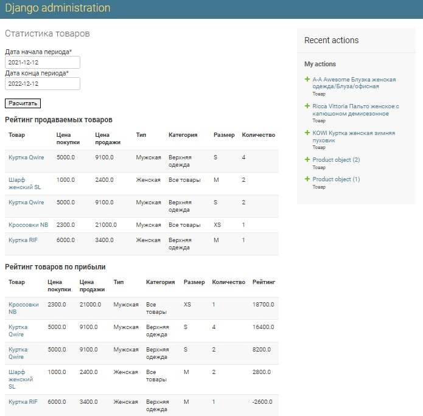

djangoShop
==========
Описание
--------
djangoShop - магазин одежды, написанный на Python с использованием фреймворка Django. 

Данный проект является обновлённой версией проекта https://github.com/alvinist27/djangoShopOld. 
djangoShop имеет более расширенный функционал. К базовым функциям магазина добавлены: регистрация продавца; возможность создания личного кабинета, через который можно добавлять товары для продажи; создан API для работы с магазином; в панель администратора добавлена страница статистики по наиболее продаваемым товарам и т.д. База данных магазина соответствует 3ей нормальной форме.



Стек технологий:
----------------
- Python
- Django
- Django Rest Framework
- Celery
- PostgreSQL
- RabbitMQ
- Docker
- HTML, CSS, Bootstrap
- Poetry
- Flake8, MyPy

Установка проекта:
---------------------
1. Клонировать репозиторий:
```
git clone https://github.com/alvinist27/djangoShop.git
cd djangoShop
```

2. Создать виртуальное окружение и установить зависимости (с помощью pip или poetry):
```
python -m venv venv
source venv/bin/activate
pip install -r requirements.txt

poetry install --no-dev
```

3. При необходимости редактировать данные .env файла.

4. Применить миграции:
```
python manage.py makemigrations
python manage.py migrate
```

5. Добавить данные в БД из фикстуры:
```
python manage.py loaddata app_users/fixtures/01_users_fixture.json
```

6. Запустить проект:
```
python manage.py runserver
```

Запуск проекта с помощью Docker:
```
docker-compose build
docker-compose up -d
```
















